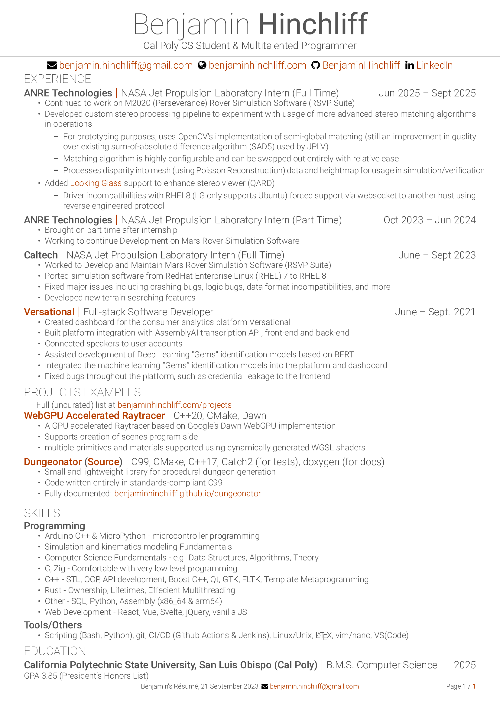

# Compact and Minimal Resume

## Requirement(s)
You must compile this resume with `XeTeX`, `XeLaTex`, `LuaTeX` or `LuaLaTeX`. *(pdfLaTex is incompatible with fontawesome)*

This resume template uses following extra packages:-
- [fontawesome](https://ctan.org/pkg/fontawesome) - For fontawesome icons
- [xcolor](https://ctan.org/pkg/xcolor) - Custom coloring
- [fontspec](https://ctan.org/pkg/fontspec) - Custom font selection 
- [fancyhdr](https://ctan.org/pkg/fancyhdr) - Custom header and footer design
- [titlesec](https://ctan.org/pkg/titlesec) - Format sections, subsections, chapters
- [hyperref](https://ctan.org/pkg/hyperref) - Link and pdf options
- [geometry](https://ctan.org/pkg/geometry) - Document dimensioning 

In addition to packages, [Roboto](https://fonts.google.com/specimen/Roboto) font family is required. *(Fonts are bundled with the project)*

## License

Copyright 2023 Benjamin Hinchliff

This work may be distributed and/or modified under the conditions of the [LaTeX Project Public License](https://www.latex-project.org/lppl/lppl-1-3c/), either version 1.3 of this license any later version.

## Acknowledgements

This resume is derived from the work of [Avinal Kumar](https://github.com/avinal/resume).
